# AceDigital Survey Site
___
### Table of Contents
* [Survey Site](#survey-site)
* [Wire Frames](#wireframes)
* [Screen Captures](#screen-captures)
* [Future Updates](#future-updates)

___
### Survey Site

Ace Digital's Survey site is a very simple responsive survey site. The main objective of the site is for registered users to create survey questions and make it available to everyone. 

#### Here are some of the major features/functionalities.

###### User
* Site Registration
* Login and Logout registered users
* Modifying user profile

###### Survey
* Creation a survey question from a template. (Multiple Choice)
* User's ability to Edit and Delete survey questions
* Everyone can submit a response to a survey question. Just click the respond button on an active survey and you can answer the questions.
* Activation and expiration date of a survey.

###### Secure Reporting Section
* Show number of respondents
* Show survey results/statistics
* Export survey results/statistics to a csv format

#### Site map
* Home - /
* Users
  * Register - /register
  * Login - /login
  * Edit Profile - /#/editprofile
* Survey
  * All Surveys - /allsurveys
  * My Surveys - /#/mysurveys
  * Respond - /#/surveys/:surveyid
  * Create - /#/surveys/newSurvey
  * Edit - /#/surveys/:surveyid/edit
* Reporting Section
  * Report - /#/surveys/:surveyid/report
  
___
### Wireframes
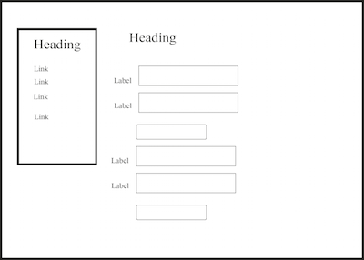
___
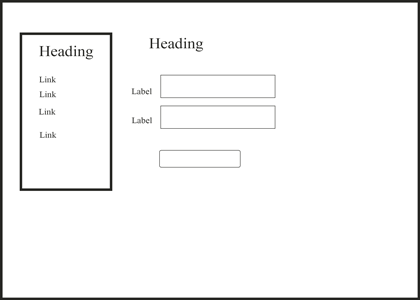
___
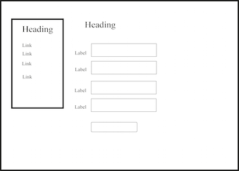
___
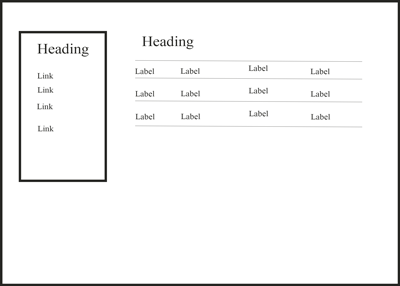
___
___
### Screen Captures
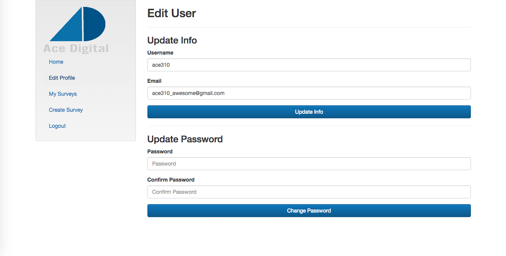
___
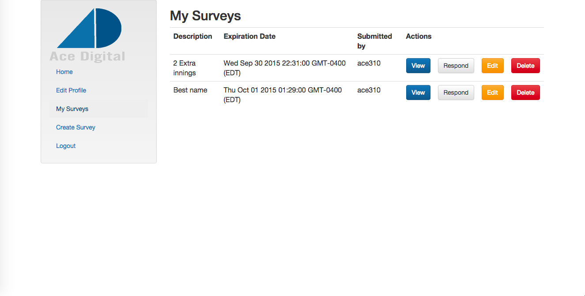
___
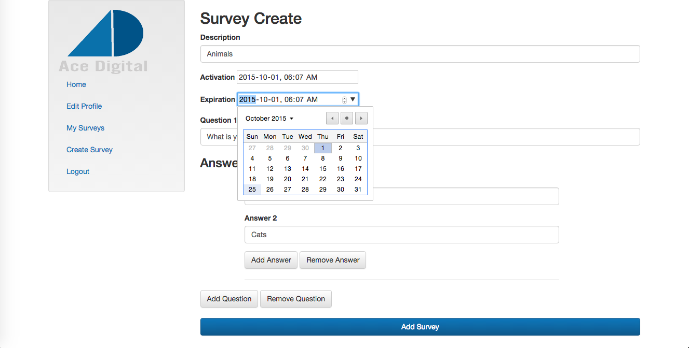
___
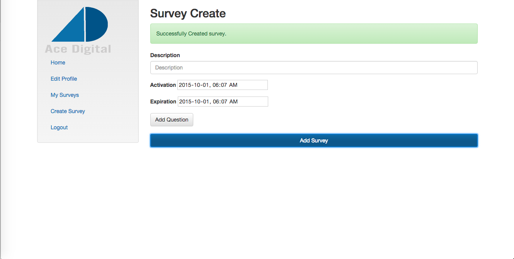
___
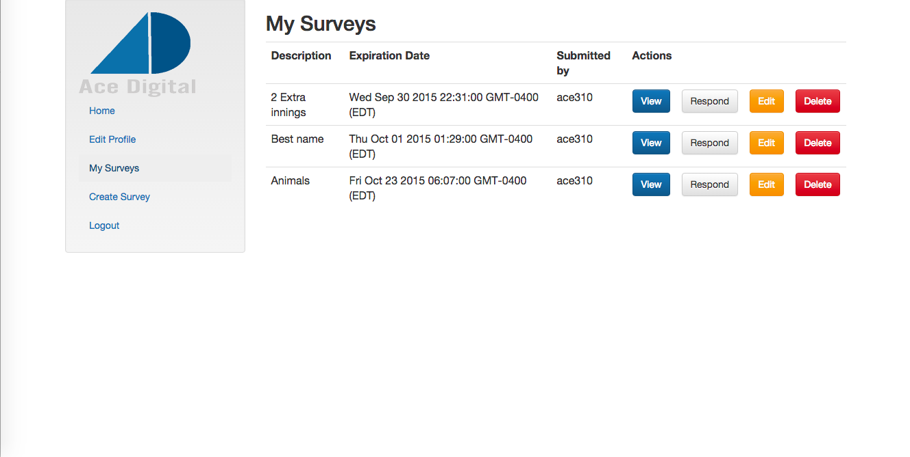
___
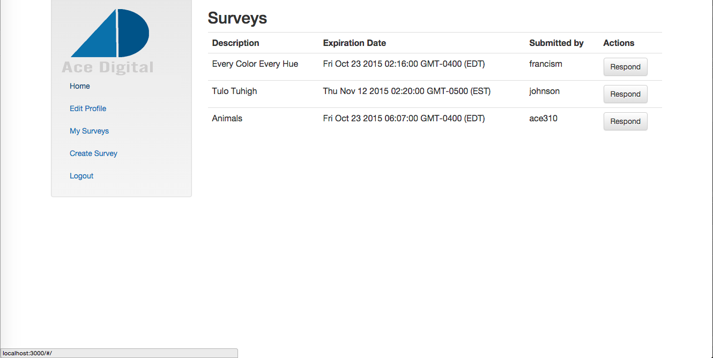
___
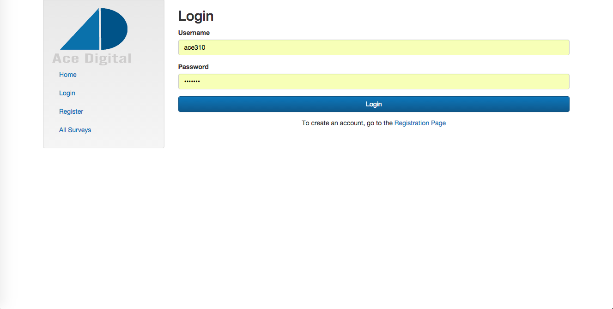
___
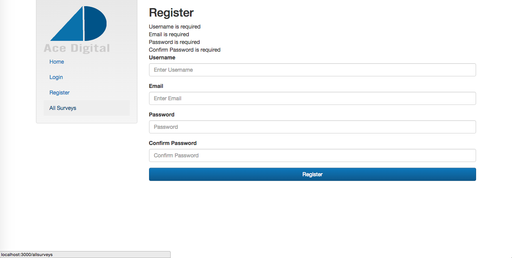
___
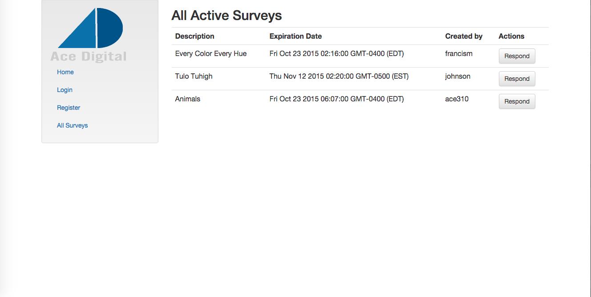
___
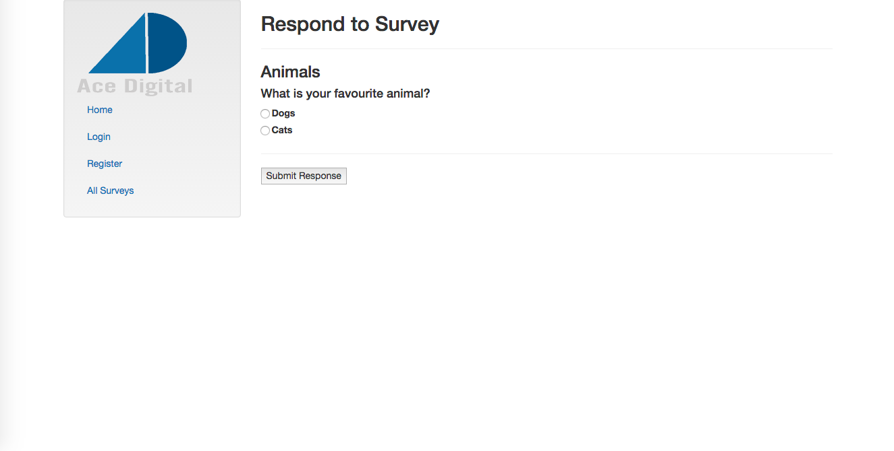
___
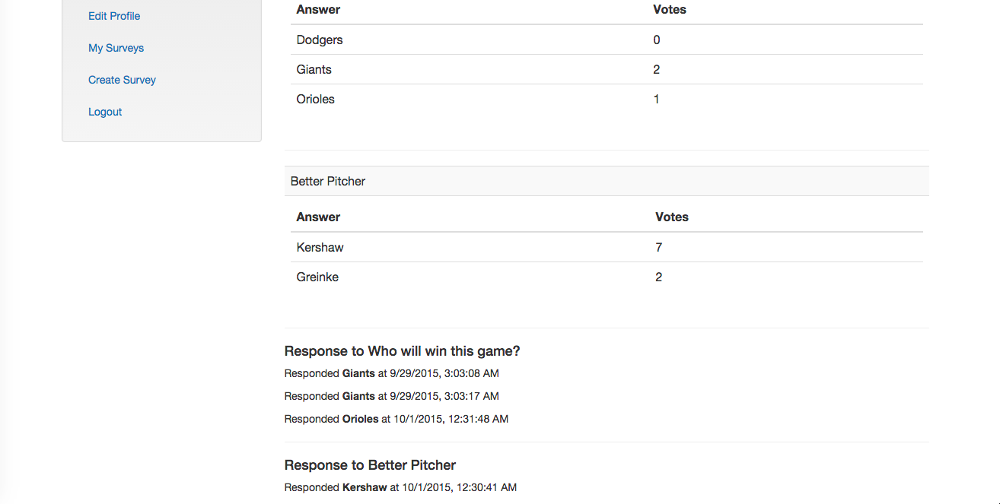
___
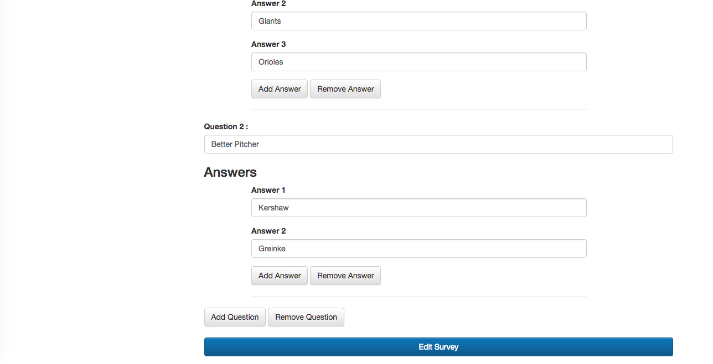

___
### Future Updates
  * More statistical data
  * Additional question templates
  * Added user roles
___
